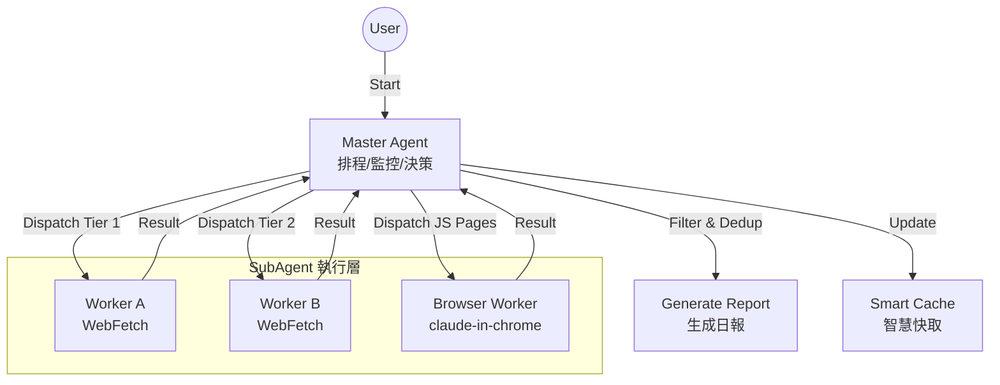

# Erduo Skills / 耳朵技能庫

[English](README_EN.md)

> 為 AI Agent 賦能，提供結構化能力與智慧工作流。

## 📖 簡介

**Erduo Skills** 是一個專門用於管理 AI Agent 智慧技能的倉庫。它作為一個知識庫和執行框架，使 Agent 能夠執行自動新聞報道、資料分析等複雜任務。

---

## ✨ 精選技能：每日日報

**每日日報** 是一個高階技能，旨在自動從多個來源抓取、篩選並總結高質量的技術新聞。

### 🏗 核心架構

該技能採用 **Master-Worker** 架構，包含智慧排程器和專用子 Agent。



### 🚀 核心特性

- **多源抓取**:
  - 聚合 HackerNews, HuggingFace Papers 等優質源。
  
- **智慧篩選**:
  - 篩選高質量技術內容，排除營銷軟文。
  
- **動態排程**:
  - 採用“早停機制”：一旦抓取到足夠的高質量條目（如 20 條），即停止抓取以節省資源。

- **瀏覽器自動化**:
  - 根據 `requires_real_browser` 欄位自動選擇工具：
    - `false`：使用 agent-browser（Headless，速度快）
    - `true`：使用 claude-in-chrome（真實瀏覽器，可通過 Cloudflare 防護）

### 📄 輸出示例

日報以結構化 Markdown 格式生成，儲存在 `NewsReport/` 目錄下。

> **Daily News Report (2024-03-21)**
>
> **1. 文章標題**
> - **摘要**: 文章內容的簡要總結...
> - **要點**: 
>   1. 要點一
>   2. 要點二
> - **來源**: [連結](...) 
> - **評分**: ⭐⭐⭐⭐⭐

---

## 📂 專案結構

```bash
├── .claude/
│   └── agents/       # Agent 定義 (Personas & Prompts)
├── skills/           # 技能實現 (例如 daily-news-report)
│   └── daily-news-report/  # 每日日報技能
├── NewsReport/       # 生成的日報存檔
├── README.md         # 專案文件 (預設為中文)
└── README_EN.md      # 英文專案文件
```

## 📋 環境需求

- **Claude Code** 或支援 MCP 的 Agent 環境
- **agent-browser skill**（可選，JS 渲染頁面抓取首選）
- **claude-in-chrome MCP**（可選，agent-browser 的 fallback）

## 🛠 安裝與使用

### 方式 1：直接使用（推薦）

```bash
# 克隆專案
git clone https://github.com/yelban/erduo-skills.TW.git
cd erduo-skills.TW

# 安裝 agent-browser skill（用於 JS 渲染頁面抓取）
mkdir -p .claude/skills
cp -r $(npm root -g)/agent-browser/skills/agent-browser .claude/skills/

# 啟動 Claude Code
claude
```

Claude Code 會自動識別 `.claude/` 目錄下的配置。

### 方式 2：整合到現有專案

```bash
# 在你的專案目錄
mkdir -p .claude/agents .claude/skills skills

# 複製 agent 定義
cp /path/to/erduo-skills/.claude/agents/worker.md .claude/agents/

# 複製技能
cp -r /path/to/erduo-skills/skills/daily-news-report skills/

# 安裝 agent-browser skill
cp -r $(npm root -g)/agent-browser/skills/agent-browser .claude/skills/

# 建立輸出目錄
mkdir -p NewsReport
```

### 執行技能

啟動 Claude Code 後，直接輸入：

> "生成今天的日報。"

## 🤝 貢獻指南

歡迎貢獻！如果您有新的技能想法，請參考 `.claude/skills` 目錄下的示例。

---

*Created with ❤️ by Erduo Team*
