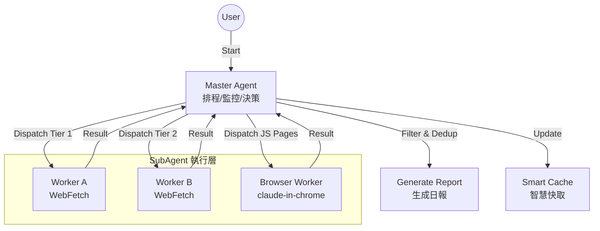

# Erduo Skills / 耳朵技能庫

[English](README_EN.md)

> 為 AI Agent 賦能，提供結構化能力與智慧工作流。

## 📖 簡介

**Erduo Skills** 是一個專門用於管理 AI Agent 智慧技能的倉庫。它作為一個知識庫和執行框架，使 Agent 能夠執行自動新聞報道、資料分析等複雜任務。

---

## ✨ 精選技能：每日日報

**每日日報** 是一個高階技能，旨在自動從多個來源抓取、篩選並總結高質量的技術新聞。

### 🏗 核心架構

該技能採用 **Master-Worker** 架構，包含智慧排程器和專用子 Agent。



### 🚀 核心特性

- **多源抓取**:
  - 聚合 HackerNews, HuggingFace Papers 等優質源。
  
- **智慧篩選**:
  - 篩選高質量技術內容，排除營銷軟文。
  
- **動態排程**:
  - 採用“早停機制”：一旦抓取到足夠的高質量條目（如 20 條），即停止抓取以節省資源。

- **瀏覽器自動化**:
  - 根據 `requires_real_browser` 欄位自動選擇工具：
    - `false`：使用 agent-browser（Headless，速度快）
    - `true`：使用 claude-in-chrome（真實瀏覽器，可通過 Cloudflare 防護）

### 📄 輸出示例

日報以結構化 Markdown 格式生成，儲存在 `NewsReport/` 目錄下。

> **Daily Picks AI News (2024-03-21)**
>
> **1. 文章標題**
> - **摘要**: 文章內容的簡要總結...
> - **要點**:
>   1. 要點一
>   2. 要點二
> - **來源**: [連結](...)
> - **評分**: ⭐⭐⭐⭐⭐

### 🎧 Podcast 收聽功能

日報閱讀器內建語音播放功能，支援台灣腔調朗讀新聞內容。

**功能特點**：
- **單項播放**：每則新聞標題旁有播放按鈕，點擊朗讀該則新聞
- **全部播放**：一鍵依序播放所有新聞（開車模式）
- **自動播放**：勾選後下次開啟頁面自動播放
- **語音設定**：可調整語速、切換 TTS 引擎

**TTS 引擎**：
| 引擎 | 品質 | 費用 | 說明 |
|------|------|------|------|
| Web Speech API | 中等 | 免費 | 瀏覽器內建，預設選項 |
| Azure TTS | 高 | 免費 50 萬字/月 | `zh-TW-HsiaoChenNeural` 語音 |
| Google Cloud TTS | 高 | 免費 100 萬字/月 | `cmn-TW-Wavenet-A` 語音 |
| Gemini TTS | 極高 | 免費額度 | 6 種語音角色，最自然 |
| Fish Audio | 極高 | 免費額度 | 社群台灣腔模型，需後端代理 |

**播放內容**：標題 + 摘要 + 要點（排除來源連結、關鍵詞、評分）

> ⚠️ **技術筆記**：現代瀏覽器的自動播放政策（Autoplay Policy）會阻止沒有用戶互動的音訊播放。因此自動播放功能會先顯示「點擊開始播放」覆蓋層，用戶點擊後才開始播放。

**Fish Audio CORS 解決方案**：

Fish Audio API 在瀏覽器端直接呼叫會遇到 CORS 限制。可透過以下方式解決：

1. **設定代理 URL**（推薦）：在語音設定中填入代理 URL
2. **自動降級**：留空代理 URL，系統會自動降級至 Web Speech API

<details>
<summary>Cloudflare Workers 代理範例（免費）</summary>

```javascript
// 部署到 Cloudflare Workers
export default {
  async fetch(request) {
    if (request.method === 'OPTIONS') {
      return new Response(null, {
        headers: {
          'Access-Control-Allow-Origin': '*',
          'Access-Control-Allow-Methods': 'POST, OPTIONS',
          'Access-Control-Allow-Headers': 'Content-Type, Authorization, model',
        }
      });
    }
    const response = await fetch('https://api.fish.audio/v1/tts', {
      method: 'POST',
      headers: {
        'Authorization': request.headers.get('Authorization'),
        'Content-Type': 'application/json',
        'model': request.headers.get('model') || 's1',
      },
      body: request.body,
    });
    const newResponse = new Response(response.body, response);
    newResponse.headers.set('Access-Control-Allow-Origin', '*');
    return newResponse;
  }
};
```

部署後將 Worker URL 填入「代理 URL」欄位即可。
</details>

---

## 📂 專案結構

```bash
├── .claude/
│   └── agents/       # Agent 定義 (Personas & Prompts)
├── skills/           # 技能實現 (例如 daily-news-report)
│   └── daily-news-report/  # 每日日報技能
├── NewsReport/       # 生成的日報存檔
├── README.md         # 專案文件 (預設為中文)
└── README_EN.md      # 英文專案文件
```

## 📋 環境需求

- **Claude Code** 或支援 MCP 的 Agent 環境
- **agent-browser skill**（可選，JS 渲染頁面抓取首選）
- **claude-in-chrome MCP**（可選，agent-browser 的 fallback）

## 🛠 安裝與使用

### 方式 1：直接使用（推薦）

```bash
# 克隆專案
git clone https://github.com/yelban/erduo-skills.TW.git
cd erduo-skills.TW

# 安裝 agent-browser skill（用於 JS 渲染頁面抓取）
mkdir -p .claude/skills
cp -r $(npm root -g)/agent-browser/skills/agent-browser .claude/skills/

# 啟動 Claude Code
claude
```

Claude Code 會自動識別 `.claude/` 目錄下的配置。

### 方式 2：整合到現有專案

```bash
# 在你的專案目錄
mkdir -p .claude/agents .claude/skills skills

# 複製 agent 定義
cp /path/to/erduo-skills/.claude/agents/worker.md .claude/agents/

# 複製技能
cp -r /path/to/erduo-skills/skills/daily-news-report skills/

# 安裝 agent-browser skill
cp -r $(npm root -g)/agent-browser/skills/agent-browser .claude/skills/

# 建立輸出目錄
mkdir -p NewsReport
```

### 執行技能

啟動 Claude Code 後，直接輸入：

> "生成今天的日報。"

---

## 🔄 外部觸發方式

除了在 Claude Code 互動介面中執行，還可以透過以下方式觸發日報生成：

| 方案 | 適用場景 | 瀏覽器抓取 |
|------|----------|-----------|
| A. CLI 指令 | 手動觸發 | ✅ 完整支援 |
| B. Cron 排程 | 本地定時 | ⚠️ 需 headless |
| C. GitHub Actions | 雲端定時 | ❌ 僅 Tier1/2 |

### 方案 A：CLI 指令

```bash
# 基本用法
cd /path/to/erduo-skills.TW && claude -p "生成今天的日報"

# 進階選項
claude -p "生成今天的日報" --output-format json --max-turns 25

# 自動核准工具
claude -p "生成今天的日報" \
  --allowedTools "Task,WebFetch,Read,Write,Bash(mkdir*),Bash(date*),Bash(ls*)"
```

### 方案 B：Cron 本地排程

使用 `scripts/generate-daily-report.sh` 腳本：

```bash
# 設定 crontab（每天 08:00 執行）
crontab -e
# 加入：0 8 * * * /path/to/erduo-skills.TW/scripts/generate-daily-report.sh
```

執行紀錄會存放在 `logs/` 目錄。

### 方案 C：GitHub Actions

本專案已配置 `.github/workflows/daily-report.yml`，支援：

- **定時執行**：每天 UTC 00:00（台灣 08:00）
- **手動觸發**：GitHub repo → Actions → Daily Picks AI News → Run workflow

⚠️ **注意**：GitHub Actions 無法執行瀏覽器自動化，僅抓取 Tier1/Tier2 來源。

**設定步驟**：
1. Fork 本專案
2. 在 repo Settings → Secrets 新增 `ANTHROPIC_API_KEY`
3. 啟用 Actions 權限

## 🤝 貢獻指南

歡迎貢獻！如果您有新的技能想法，請參考 `.claude/skills` 目錄下的示例。

---

*Created with ❤️ by Erduo Team*
