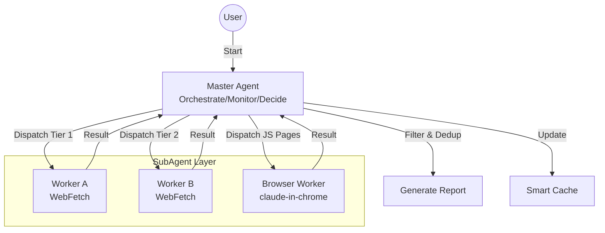

# Erduo Skills

[中文](README.md)

> Empowering AI Agents with structured capabilities and intelligent workflows.

## 📖 Overview

**Erduo Skills** is a specialized repository designed to house and manage intelligent skills for AI agents. It serves as a knowledge base and execution framework, enabling agents to perform complex tasks such as autonomous news reporting, data analysis, and more.

---

## ✨ Featured Skill: Daily News Report

The **Daily News Report** is a sophisticated skill designed to autonomously fetch, filter, and summarize high-quality technical news from multiple sources.

### 🏗 Architecture

This skill utilizes a **Master-Worker** architecture with a smart orchestrator and specialized sub-agents.



### 🚀 Key Features

- **Multi-Source Fetching**:
  - Aggregates content from HackerNews, HuggingFace Papers, etc.
  
- **Smart Filtering**:
  - Filters for high-quality technical content, excluding marketing fluff.
  
- **Dynamic Scheduling**:
  - Uses an "Early Stopping" mechanism: if enough high-quality items are found (e.g., 20 items), it stops fetching to save resources.

- **Browser Automation**:
  - Handles JS-rendered pages (e.g., ProductHunt) using agent-browser (preferred) or claude-in-chrome.

### 📄 Output Example

Reports are generated in structured Markdown format, stored in the `NewsReport/` directory.

> **Daily News Report (2024-03-21)**
>
> **1. Title of the Article**
> - **Summary**: A concise summary of the article...
> - **Key Points**: 
>   1. Point one
>   2. Point two
> - **Source**: [Link](...) 
> - **Rating**: ⭐⭐⭐⭐⭐

---

## 📂 Project Structure

```bash
├── .claude/
│   └── agents/       # Agent personas & prompts
├── skills/           # Executable skill definitions
│   └── daily-news-report/  # The Daily News Report skill
├── NewsReport/       # Generated daily reports
├── README.md         # Project documentation (Chinese by default)
└── README_EN.md      # Project documentation (English)
```

## 📋 Requirements

- **Claude Code** or MCP-compatible Agent environment
- **agent-browser skill** (optional, preferred for JS-rendered pages)
- **claude-in-chrome MCP** (optional, fallback for agent-browser)

## 🛠 Installation & Usage

### Option 1: Direct Usage (Recommended)

```bash
# Clone the repository
git clone https://github.com/yelban/erduo-skills.TW.git
cd erduo-skills.TW

# Install agent-browser skill (for JS-rendered page fetching)
mkdir -p .claude/skills
cp -r $(npm root -g)/agent-browser/skills/agent-browser .claude/skills/

# Start Claude Code
claude
```

Claude Code will automatically recognize configurations under `.claude/` directory.

### Option 2: Integrate into Existing Project

```bash
# In your project directory
mkdir -p .claude/agents .claude/skills skills

# Copy agent definition
cp /path/to/erduo-skills/.claude/agents/worker.md .claude/agents/

# Copy skill
cp -r /path/to/erduo-skills/skills/daily-news-report skills/

# Install agent-browser skill
cp -r $(npm root -g)/agent-browser/skills/agent-browser .claude/skills/

# Create output directory
mkdir -p NewsReport
```

### Run the Skill

After starting Claude Code, simply type:

> "Generate today's news report."

## 🤝 Contributing

Contributions are welcome! If you have a new skill idea, please check the `.claude/skills` directory for examples.

---

*Created with ❤️ by Erduo Team*
