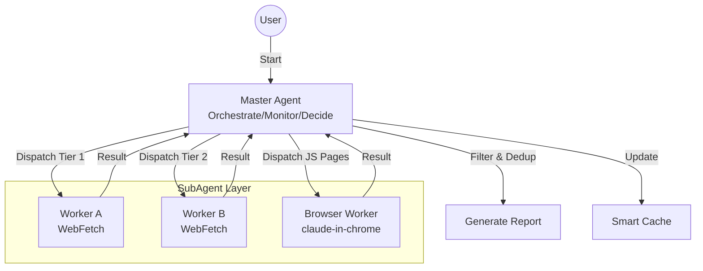

# Erduo Skills

[中文](README.md)

> Empowering AI Agents with structured capabilities and intelligent workflows.

## 📖 Overview

**Erduo Skills** is a specialized repository designed to house and manage intelligent skills for AI agents. It serves as a knowledge base and execution framework, enabling agents to perform complex tasks such as autonomous news reporting, data analysis, and more.

---

## ✨ Featured Skill: Daily Picks AI News

The **Daily Picks AI News** is a sophisticated skill designed to autonomously fetch, filter, and summarize high-quality technical news from multiple sources.

### 🏗 Architecture

This skill utilizes a **Master-Worker** architecture with a smart orchestrator and specialized sub-agents.



### 🚀 Key Features

- **Multi-Source Fetching**:
  - Aggregates content from HackerNews, HuggingFace Papers, etc.
  
- **Smart Filtering**:
  - Filters for high-quality technical content, excluding marketing fluff.
  
- **Dynamic Scheduling**:
  - Uses an "Early Stopping" mechanism: if enough high-quality items are found (e.g., 20 items), it stops fetching to save resources.

- **Browser Automation**:
  - Auto-selects tool based on `requires_real_browser` field:
    - `false`: Uses agent-browser (Headless, faster)
    - `true`: Uses claude-in-chrome (Real browser, bypasses Cloudflare)

### 📄 Output Example

Reports are generated in structured Markdown format, stored in the `NewsReport/` directory.

> **Daily Picks AI News (2024-03-21)**
>
> **1. Title of the Article**
> - **Summary**: A concise summary of the article...
> - **Key Points**:
>   1. Point one
>   2. Point two
> - **Source**: [Link](...)
> - **Rating**: ⭐⭐⭐⭐⭐

### 🎧 Podcast Listening Feature

The report reader includes built-in text-to-speech functionality with Taiwanese Mandarin voice.

**Features**:
- **Single Item Play**: Play button next to each news title for individual playback
- **Play All**: Sequential playback of all news items (driving mode)
- **Auto Play**: Enable to automatically start playback on page load
- **Voice Settings**: Adjustable speech rate and TTS engine selection

**TTS Engines**:
| Engine | Quality | Cost | Notes |
|--------|---------|------|-------|
| Web Speech API | Medium | Free | Browser built-in, default option |
| Azure TTS | High | Free 500K chars/month | `zh-TW-HsiaoChenNeural` voice |
| Google Cloud TTS | High | Free 1M chars/month | `cmn-TW-Wavenet-A` voice |

**Playback Content**: Title + Summary + Key Points (excludes source links, keywords, ratings)

> ⚠️ **Technical Note**: Modern browser Autoplay Policy blocks audio playback without user interaction. Therefore, the auto-play feature shows a "Click to Start" overlay first, and playback begins only after user clicks.

---

## 📂 Project Structure

```bash
├── .claude/
│   └── agents/       # Agent personas & prompts
├── skills/           # Executable skill definitions
│   └── daily-news-report/  # The Daily Picks AI News skill
├── NewsReport/       # Generated daily reports
├── README.md         # Project documentation (Chinese by default)
└── README_EN.md      # Project documentation (English)
```

## 📋 Requirements

- **Claude Code** or MCP-compatible Agent environment
- **agent-browser skill** (optional, preferred for JS-rendered pages)
- **claude-in-chrome MCP** (optional, fallback for agent-browser)

## 🛠 Installation & Usage

### Option 1: Direct Usage (Recommended)

```bash
# Clone the repository
git clone https://github.com/yelban/erduo-skills.TW.git
cd erduo-skills.TW

# Install agent-browser skill (for JS-rendered page fetching)
mkdir -p .claude/skills
cp -r $(npm root -g)/agent-browser/skills/agent-browser .claude/skills/

# Start Claude Code
claude
```

Claude Code will automatically recognize configurations under `.claude/` directory.

### Option 2: Integrate into Existing Project

```bash
# In your project directory
mkdir -p .claude/agents .claude/skills skills

# Copy agent definition
cp /path/to/erduo-skills/.claude/agents/worker.md .claude/agents/

# Copy skill
cp -r /path/to/erduo-skills/skills/daily-news-report skills/

# Install agent-browser skill
cp -r $(npm root -g)/agent-browser/skills/agent-browser .claude/skills/

# Create output directory
mkdir -p NewsReport
```

### Run the Skill

After starting Claude Code, simply type:

> "Generate today's news report."

---

## 🔄 External Trigger Methods

Besides running in Claude Code interactive mode, you can trigger report generation via:

| Method | Use Case | Browser Fetch |
|--------|----------|---------------|
| A. CLI Command | Manual trigger | ✅ Full support |
| B. Cron Schedule | Local scheduling | ⚠️ Headless only |
| C. GitHub Actions | Cloud scheduling | ❌ Tier1/2 only |

### Method A: CLI Command

```bash
# Basic usage
cd /path/to/erduo-skills.TW && claude -p "Generate today's news report"

# Advanced options
claude -p "Generate today's news report" --output-format json --max-turns 25

# Auto-approve tools
claude -p "Generate today's news report" \
  --allowedTools "Task,WebFetch,Read,Write,Bash(mkdir*),Bash(date*),Bash(ls*)"
```

### Method B: Cron Local Scheduling

Use the `scripts/generate-daily-report.sh` script:

```bash
# Set up crontab (run daily at 08:00)
crontab -e
# Add: 0 8 * * * /path/to/erduo-skills.TW/scripts/generate-daily-report.sh
```

Execution logs are stored in the `logs/` directory.

### Method C: GitHub Actions

This project includes `.github/workflows/daily-report.yml` with:

- **Scheduled execution**: Daily at UTC 00:00 (08:00 Taiwan time)
- **Manual trigger**: GitHub repo → Actions → Daily Picks AI News → Run workflow

⚠️ **Note**: GitHub Actions cannot run browser automation, only Tier1/Tier2 sources are fetched.

**Setup steps**:
1. Fork this repository
2. Add `ANTHROPIC_API_KEY` in repo Settings → Secrets
3. Enable Actions permissions

## 🤝 Contributing

Contributions are welcome! If you have a new skill idea, please check the `.claude/skills` directory for examples.

---

*Created with ❤️ by Erduo Team*
